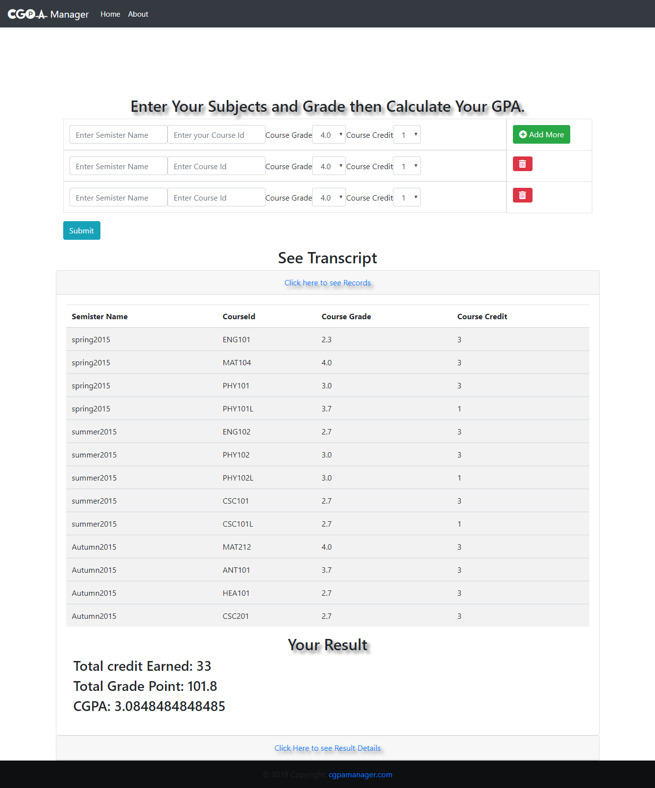
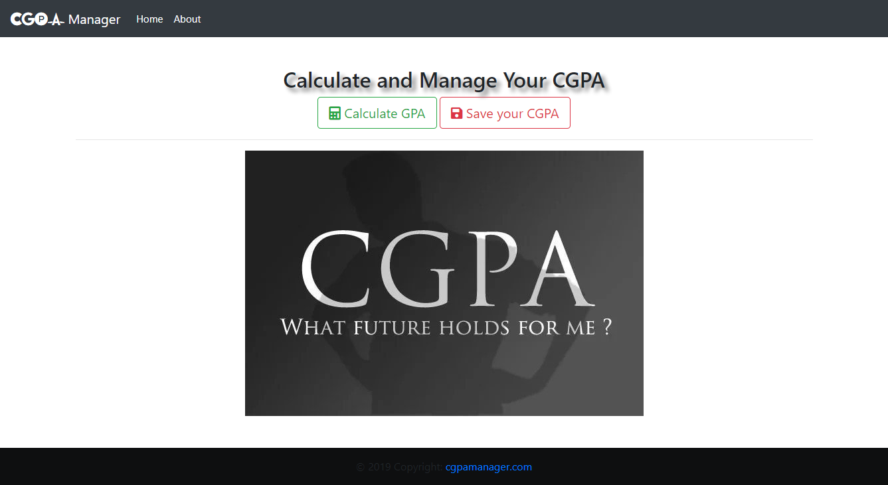
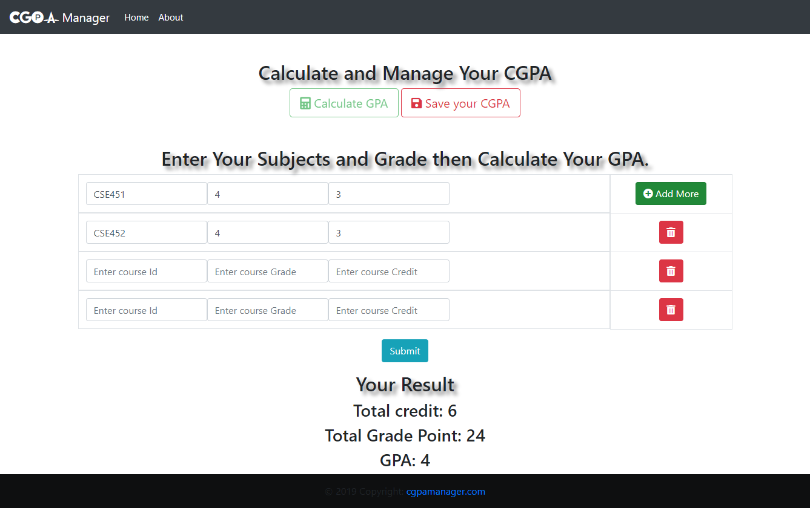

# cgpaManager

a web based app, whith this you can calculated your GPA and also you can record your semister wise result and CGPA.

# Unig Proramming Languages
1. HTML, CSS
2. Bootstrap
3. Javascript
4. JQuery (Ajex, wow js)
5. PHP
6. My SQL

# Website Screenshots

